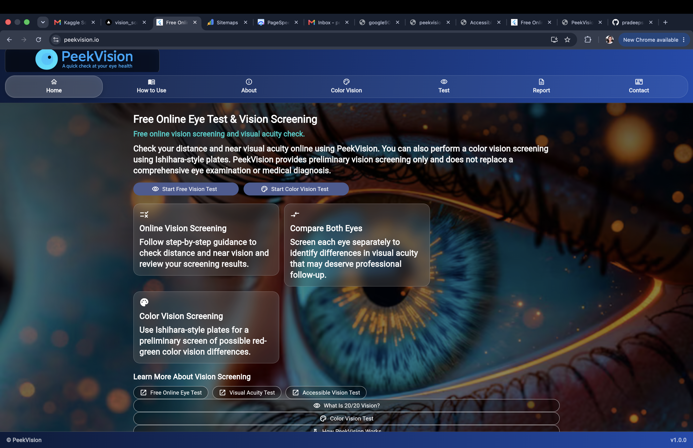
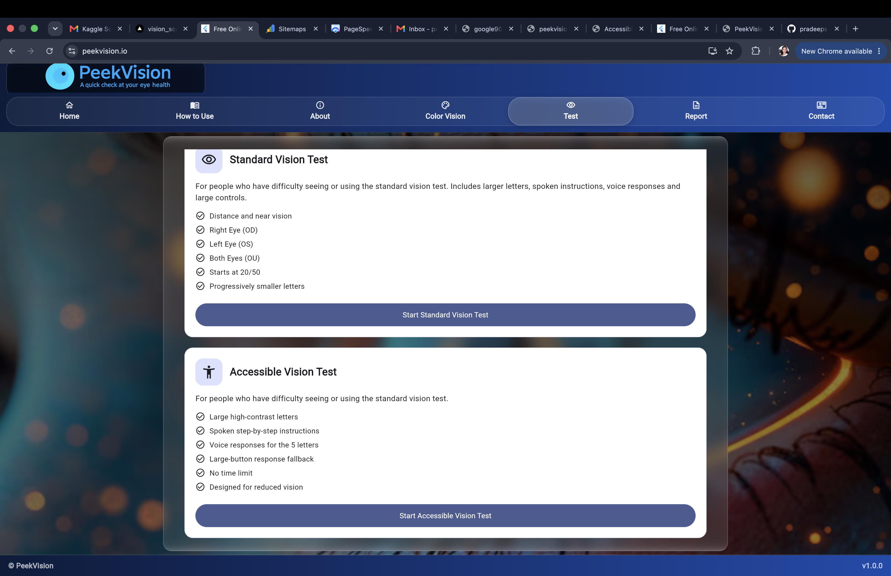
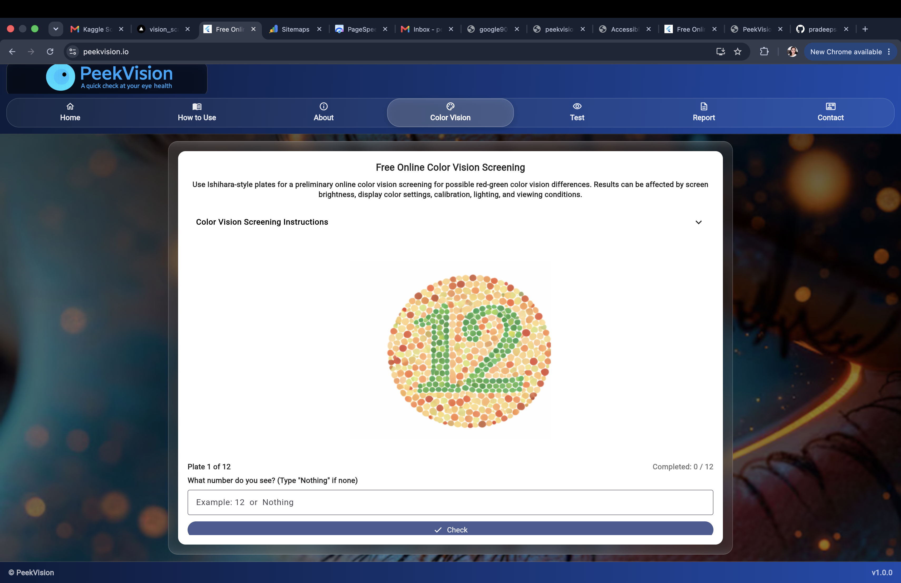

# PeekVision

PeekVision is a free browser-based vision screening application designed to help users perform preliminary visual acuity and color vision checks online.

Live site: https://www.peekvision.io/

## Features

- Standard visual acuity screening
- Right eye, left eye, and both-eye testing
- Snellen-style visual acuity results
- Distance and near vision screening
- Accessible high-contrast vision test
- Spoken instructions
- Optional voice responses
- Large manual response controls
- Color vision screening
- Browser-based reports
- No account required

## Screenshots

### Home

### Vision Test Options

### Color Vision Screening

## Accessible Vision Testing

PeekVision includes an accessible screening mode designed for users who may benefit from:

- Larger high-contrast letters
- Spoken instructions
- Voice-assisted responses
- Large buttons
- Manual response fallback
- Extended response time

Learn more:

https://www.peekvision.io/accessible-vision-test.html

## Visual Acuity Screening

PeekVision provides browser-based visual acuity screening for:

- Right eye (OD)
- Left eye (OS)
- Both eyes (OU)

Visual acuity results are shown using familiar Snellen-style values such as 20/20, 20/40, and 20/100.

Learn more:

https://www.peekvision.io/visual-acuity-test.html

## Color Vision Screening

PeekVision also includes an online color vision screening experience using color-plate based testing.

https://www.peekvision.io/color-vision-test.html

## Methodology

Details about how the screening works, Snellen and logMAR representation, accessibility features, test conditions, and limitations are available here:

https://www.peekvision.io/methodology.html

## Important Disclaimer

PeekVision is an informational screening tool only.

It does not provide a medical diagnosis, prescription, or replacement for a comprehensive examination by an optometrist or ophthalmologist.

Results may be affected by screen size, browser scaling, display calibration, viewing distance, lighting conditions, and other factors.

## Technology

PeekVision is built with:

- Flutter
- Dart
- Flutter Web
- Responsive browser-based UI

## Privacy

PeekVision is designed to provide the current screening experience without requiring users to create an account.

Privacy policy:

https://www.peekvision.io/privacy.html

## Website

https://www.peekvision.io/

## Contact

peekvision.eyetest@gmail.com